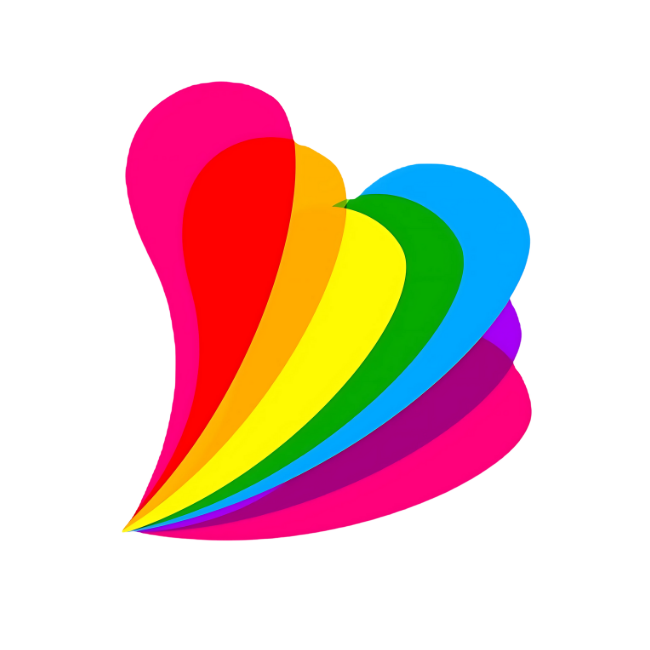

# Mujer LGBTQ+ Website



## Project Overview

This website was developed for **Mujer LGBTQ+**, an advocacy organization based in **Zamboanga City**, Philippines. This project represents our team's first collaborative effort in creating a complete website solution for a real client, marking a significant milestone in our web development journey.

## Project Significance

- **First Client Project**: Our inaugural experience working with a real client and implementing their vision
- **Academic Finals**: Served as our final project for **Web Development CIT003** course
- **2nd Year, 1st Semester**: A defining project during our college journey
- **Team Collaboration**: First major collaborative effort as a development team
- **Career Foundation**: The groundbreaking project that launched our journey as web developers

## Technology Stack

- **HTML5**: Semantic markup and structure
- **CSS3**: Custom styling with responsive design
- **Vanilla JavaScript**: Interactive functionality without frameworks
- **Pure Implementation**: No external libraries or frameworks used

## Development Team

This project was developed by a dedicated team of **5 college students** working collaboratively to deliver a professional website solution:

- **Kenneth Clyde A. Que**
- **Jon Antonee Orillineda**
- **Qhaleed Resham Kadiri**
- **Joshua Guiritan**
- **Donald Lee Novo**

## Project Features

### Core Pages

- **Landing Page**: Hero section with organization branding
- **About Us**: Mission, vision, and organizational information
- **Services**: LGBTQ+ support services and resources
- **Events**: Community events and activities
- **Partners**: Collaborating organizations
- **Donation**: Support contribution system
- **Application**: Volunteer and membership forms

### Key Features

- **Responsive Design**: Mobile-first approach ensuring compatibility across devices
- **Custom Styling**: Tailored design reflecting the client's brand identity
- **LGBTQ+ Theming**: Pride colors and inclusive design elements
- **Contact Integration**: Easy communication channels
- **Service Catalog**: Interactive product/service browsing
- **Application Forms**: User registration and volunteer applications

## Project Structure

```
mujer-page-cit003/
├── index.html              # Main landing page
├── assets/                 # Media and font resources
│   ├── images/            # Image assets
│   └── fonts/             # Custom typography
├── pages/                 # Individual page components
│   ├── services-page/     # Services and products
│   ├── events-page/       # Community events
│   ├── forms-page/        # Application forms
│   ├── partnerpage/       # Partner organizations
│   └── other-works-page/  # Additional content
├── styles/                # CSS stylesheets
│   ├── app.css           # Global styles
│   └── landing-page.css   # Homepage specific styles
└── scripts/               # JavaScript functionality
    ├── main.js           # Core functionality
    ├── donation.js       # Donation system
    └── services.js       # Service interactions
```

## 🌟 Client Collaboration

### Client: Mujer LGBTQ+ Organization

- **Location**: Zamboanga City, Philippines
- **Focus**: LGBTQ+ advocacy and community support
- **Requirements**: Informative website showcasing their mission and services
- **Design Preferences**: Inclusive, colorful, and accessible design

### Development Process

1. **Client Consultation**: Understanding organizational needs and vision
2. **Design Planning**: Creating layouts that reflect LGBTQ+ pride and inclusivity
3. **Development**: Building responsive, accessible web pages
4. **Content Integration**: Incorporating client-provided information and media
5. **Testing & Refinement**: Ensuring cross-device compatibility
6. **Delivery**: Providing a complete, functional website solution

## Learning Outcomes

This project provided invaluable experience in:

- **Client Communication**: Managing real-world client expectations and requirements
- **Team Collaboration**: Coordinating with 5 team members effectively
- **Responsive Design**: Creating mobile-friendly, accessible interfaces
- **Vanilla JavaScript**: Building interactive features without framework dependencies
- **Project Management**: Meeting academic deadlines while delivering client value
- **Professional Development**: Understanding the complete web development lifecycle

## Technical Achievements

- **Pure HTML/CSS/JS Implementation**: No external dependencies
- **Responsive Grid Layouts**: Custom CSS Grid and Flexbox implementations
- **Interactive Components**: Dynamic navigation, forms, and service catalog
- **Performance Optimization**: Optimized images and efficient code structure
- **Cross-Browser Compatibility**: Ensuring consistent experience across platforms
- **Accessibility**: LGBTQ+ inclusive design with proper semantic markup

## Academic Context

**Course**: Web Development CIT003  
**Academic Level**: 2nd Year College, 1st Semester  
**Project Type**: Final Project  
**Team Size**: 5 Students  
**Duration**: Full Semester Project

## Impact & Legacy

This project marked the beginning of our professional web development journey, teaching us:

- The importance of understanding client needs
- The value of teamwork in software development
- How to create inclusive, accessible web experiences
- The satisfaction of delivering real-world solutions
- The foundation skills that would guide our future careers

## Client Information

**Organization**: Mujer LGBTQ+  
**Location**: Zamboanga City, Philippines  
**Mission**: Supporting and advocating for LGBTQ+ rights and community development

## Repository

This repository serves as both our academic submission and a portfolio piece demonstrating our growth as web developers through our first significant client collaboration.

---

_This project represents more than just code – it's the foundation of our journey as web developers and our commitment to creating inclusive digital experiences._

## Tags

`#WebDevelopment` `#HTML` `#CSS` `#JavaScript` `#LGBTQ` `#ClientProject` `#TeamWork` `#College` `#Finals` `#ZamboangaCity` `#ResponsiveDesign` `#VanillaJS`
